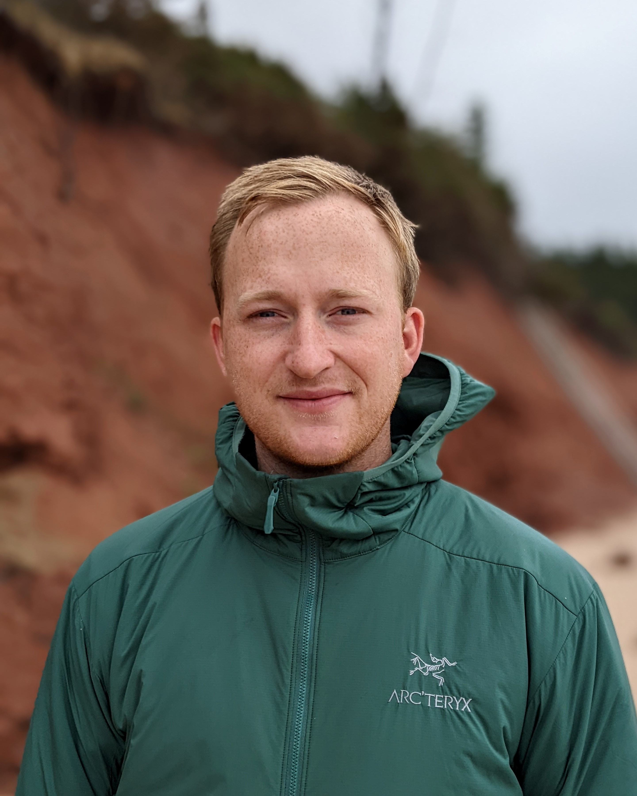

---
layout: hello-default

# using Markdown language, you can customize the following variables!

# these variables are required -------------------------------
banner_title: Sutubra Research
banner_subtitle: Test
background_image: /images/back1.png

# all of the following variables are optional -----------------
#page_url: /hello # only include this variable if you aren't building the page to your primary domain

# favicon
favicon: /assets/ico/logo.ico

# social media
#twitter_username: notsaragong # # your twitter handle
github_username:  SutubraResearch # your github username
linkedin: cameron~wade/ # the part after ("https://www.linkedin.com/in/...")
# facebook_username: <-- your facebook username (the part after "https://www.facebook.com/...")
# google_analytics: <-- your google analytics Tracking ID

# By declaring these variables, you can include a button that links to an external website or to media.
# about_button: https://github.com/saragong/hello # the link
# about_button_label: get hello # the label on the button

# optional about section ------------------------------------------

about: about # the heading for your portfolio and title of your YAML file
about_description:   # a description to be desplayed below the heading and above the content

# optional portfolio section ------------------------------------------

# By declaring these variables, you can include a portfolio showcasing your work and organize your portfolio's items into a custom layout, all without adding any CSS. In addition, you must 1) create an HTML file in the_includes folder for each project with the text you'd like to display, and 2) create a YAML file in the _data folder describing the order in which each project should be shown and categorized. See `/includes/example.html` and `/_data/work.yml` for examples.

portfolio: work # the heading for your portfolio and title of your YAML file
portfolio_description:   # a description to be desplayed below the heading and above the content

# optional CTA section --------------------------------------------------

# By declaring these variables, you can include a CTA section.
cta: connect # the heading for your CTA section
cta_description: curious about how we can work together? # a description to be displayed below the heading and above the content
cta_button: mailto:cameron@sutubra.ca # a link to an external website or to media
cta_button_label: contact # the label on the button

---			
[//]: # (write a bit about yourself here)
At Sutubra Research, we specialize in power system and integrated energy system modelling to support strategic decision-making. We work with clients across North America—including governments, utilities, and independent power producers—providing expertise in capacity expansion modelling, renewable energy integration, and integrated resource planning. Our solutions combine open modelling frameworks with deep industry knowledge to ensure informed decision-making in an evolving energy landscape.

**How We Work**

- **Proven Models**: We apply established energy system models to deliver practical, actionable insights.
- **Tailored Solutions**: Every client is unique, and we customize or develop bespoke models to fit specific needs.
- **Keeping Current**: We collaborate with leading academics and integrate the latest research to refine our 
methods and ensure our models reflect industry best practices.
- **Thorough Analysis**: Our work is grounded in robust mathematical and computational methods to provide reliable, data-driven advice.

By bringing these elements together, we help you not just adapt to the energy transition, but lead it.

**People**

**Cameron Wade** is the Founder and Principal of Sutubra Research. He focuses on developing and applying energy system optimization models to support strategic decision-making across public and private sectors. He has contributed to national model intercomparison studies in the U.S. and Canada, and his analysis on hydrogen tax credits has been cited by U.S. lawmakers. In addition to consulting, Cameron collaborates with academic researchers, publishing peer-reviewed studies and developing open-source tools such as Temoa. He holds MSc degrees in Physics and Mathematics and previously worked at the European Space Agency’s Advanced Concepts Team.
